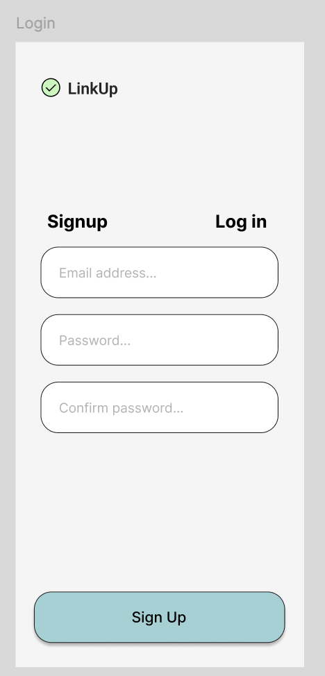
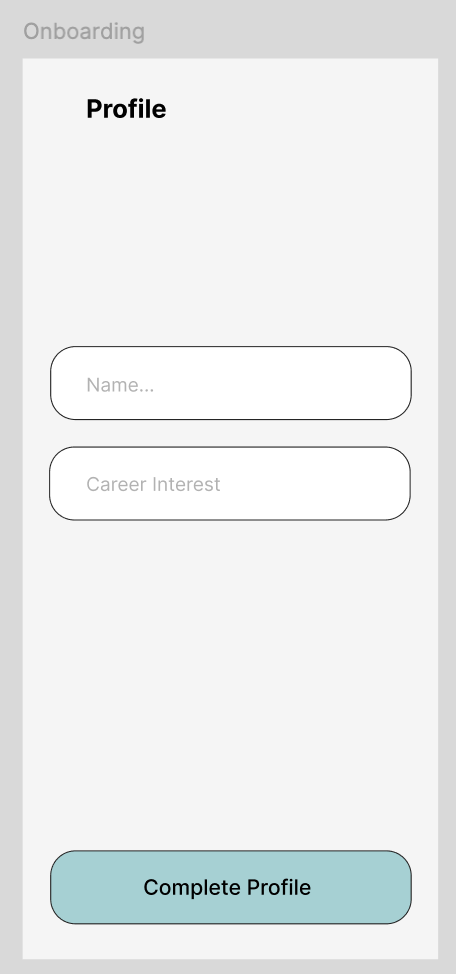
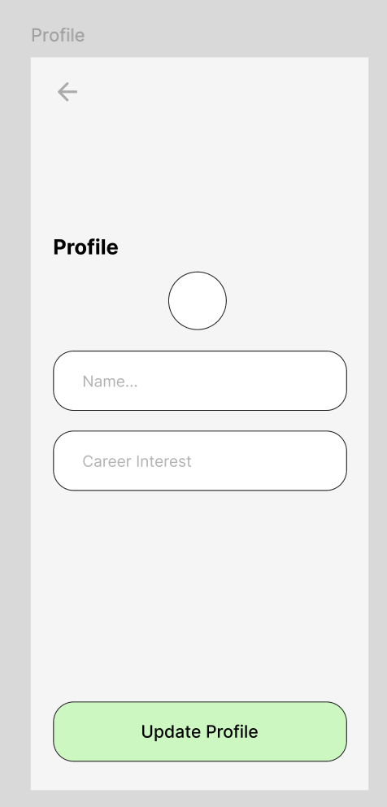
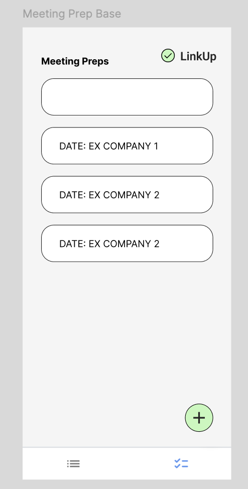
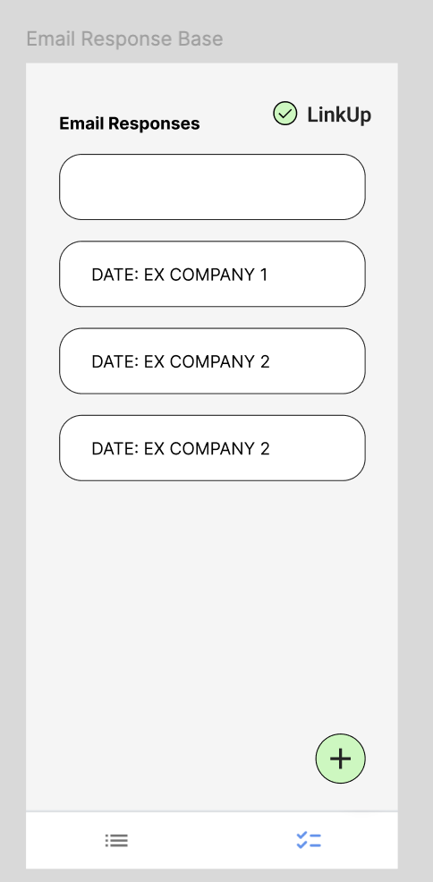
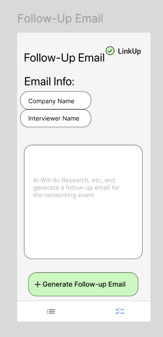
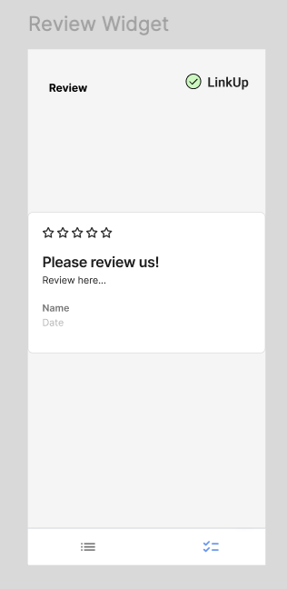

# LinkUp User Guide

## App Overview

LinkUp is an AI-powered productivity app designed to help users prepare for meetings, generate professional email responses, and create follow-up messages quickly and efficiently.

Built for students, professionals, and job seekers, LinkUp simplifies communication and preparation by using AI to generate structured and high-quality content in seconds.

### Key Features
- AI-generated meeting preparation
- Instant email response generation
- Automated follow-up emails
- Simple onboarding and profile setup
- Clean and easy-to-use interface

---

## Who This App Is For

LinkUp is designed for:
- Students preparing for interviews
- Professionals attending meetings
- Users who want quick and polished communication

No technical experience is required to use the app.

---

## Getting Started

### Step 1: Sign Up / Log In
1. Open the app  
2. Enter your email and password  
3. Tap **Sign Up** or **Log In**

---

### Step 2: Complete Onboarding
1. Enter your name  
2. Select your career interest  
3. Tap **Complete Profile**

---

### Step 3: Set Up Your Profile
- Add or edit your name  
- Update your career interest  
- Upload a profile picture  

Tap **Update Profile** to save.

---

## How to Use the App

### Meeting Preparation

Prepare for meetings using AI-generated insights.

#### Steps:
1. Navigate to **Meeting Prep**
2. Enter:
   - Interviewer name  
   - Company name  
   - Additional details  
3. Tap **Generate Meeting Prep**

---

### Email Responses

Quickly generate professional replies to emails.

#### Steps:
1. Go to **Email Responses**
2. Enter context or select an option  
3. Tap **Generate Email Response**

---

### Follow-Up Emails

Create follow-up emails after meetings.

#### Steps:
1. Open **Follow-Up Email**
2. Enter:
   - Company name  
   - Interviewer name  
3. Tap **Generate Follow-up Email**

---

### Review Feature

Users can leave feedback after using the app.

- Rate your experience  
- Submit feedback  

---

## Full App Walkthrough

1. User logs in or signs up  
2. Completes onboarding  
3. Sets up profile  
4. Accesses main tools:
   - Meeting Prep  
   - Email Responses  
   - Follow-Up Emails  
5. Inputs information  
6. Generates AI content  
7. Reviews and uses results  

---

## Navigation Overview

- **Login Screen** → Access your account  
- **Onboarding Screen** → Enter basic info  
- **Profile Screen** → Manage user data  
- **Main Feature Screens** → Use AI tools  
- **Review Screen** → Provide feedback  

---

## Tips for Best Results

- Enter detailed information for better AI output  
- Use follow-up emails after every meeting  
- Keep your profile updated  

---

## Troubleshooting

**App not generating results**
- Check internet connection  
- Make sure all fields are filled  

**Login issues**
- Verify credentials  
- Reset password if needed  

---

## Support

If you experience issues, contact your development team or course support resources.

---

This user documentation provides a complete walkthrough of LinkUp, helping users understand how to navigate and use all major features effectively.
