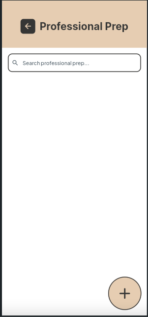
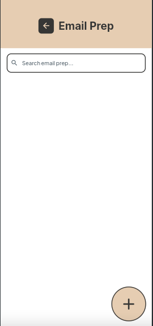
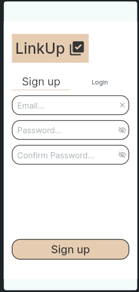
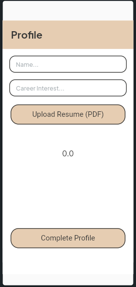
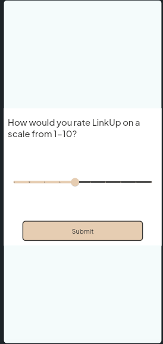

  

<h1 align="center">LinkUp AI</h1>

AI-Powered Professional Prep Assistant

---

  <button style="background-color:#01875f;color:white;padding:12px 28px;border:none;border-radius:8px;font-size:16px;">
    Install
  </button>

---

## Screenshots

  
  
  
  

---

## About this app

LinkUp is an AI-powered productivity app that helps you prepare for interviews, meetings, and professional communication in seconds.

Instead of overthinking what to say, LinkUp generates structured, high-quality responses instantly.

Use it to:
- Prepare for interviews and meetings  
- Generate professional email responses  
- Create follow-up messages  

All inside a clean and simple interface.

---

## Try LinkUp

<iframe src="YOUR_FLUTTERFLOW_WEB_APP_LINK" width="100%" height="650" style="border-radius:12px;border:1px solid #ddd;"></iframe>

---

## Features

### Smart Meeting Prep
Generate talking points, questions, and insights for interviews and meetings.

### Email Generation
Create professional email responses instantly.

### Follow-Up Messages
Send polished follow-ups after meetings or interviews.

### Simple Profile Setup
Quick onboarding with resume upload and career interests.

---

## Who it's for

- Students preparing for internships  
- Job seekers  
- Professionals in meetings  
- Anyone who wants better communication fast  

---

## User Experience

  
  
  

---

## How it works

1. Sign up or log in  
2. Complete your profile  
3. Choose a feature (Meeting Prep or Email Prep)  
4. Enter details  
5. Generate AI response  
6. Copy and use  

---

## Tips

- Be specific with inputs for better results  
- Review AI responses before sending  
- Use follow-ups after meetings  
- Keep your profile updated  

---

## Support

For issues or questions, contact the LinkUp development team.

---

## 7. Final App Website Link

https://your-linkup-app-site.com
